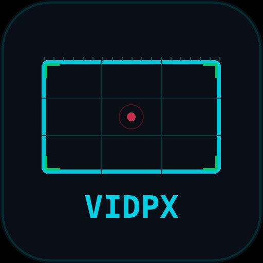

# VIDPIX Monitor

**Pixel Resolution Calculator & Output Engine**

A professional browser-based tool for video production, projection mapping, and AV engineering. Calculate pixel resolutions, overlay composition guides, draw projection masks, and output to external displays — all from a single-file PWA.



## Features

### Resolution & Timing
- 12 resolution presets (SD to 8K, including TikTok, Anamorphic, IMAX)
- Custom width/height input with pixel precision
- Frame rate selection with all standard rates (23.976 – 240 fps) + custom input
- Refresh rate selection (24 – 360 Hz) including 59.94 Hz NTSC + custom input
- Bit depth (8/10/12/16-bit) and chroma subsampling (4:4:4, 4:2:2, 4:2:0)
- Live bandwidth calculations: bitrate, frame size, per minute, per hour
- FPS/Hz mismatch warning for frame drop risk

### Canvas Overlays
- **Rule of Thirds** — grid with intersection points
- **Golden Ratio** — phi-based guide lines
- **Center Point** — concentric target rings
- **Crosshair** — full-frame center lines
- **Corner Marks** — registration marks
- **Diagonals** — corner-to-corner lines
- **H-Guide / V-Guide** — adjustable position via slider
- **Safe Zone** — adjustable percentage (50–100%)
- **Pixel Grid** — subdivision grid
- **Ruler** — pixel-accurate tick marks every 10px along all edges, with labels at 100px intervals. Toggle between 0,0 top-left origin and ±center origin.

### Video Source Overlay
- **Camera** — live feed from webcam or capture card (Cam Link, Blackmagic, etc.)
- **Screen Share** — live stream from any window, tab, or display
- Adjustable opacity blending
- Fit modes: Contain, Cover, Stretch

### Projection Mask Tool
- **Polygon drawing** — click points to define freeform mask shapes
- **Rectangle tool** — click two corners for rectangular masks
- **Invert** — toggle mask inside/outside shapes (even-odd fill)
- **Undo / Clear** — per-point undo with Ctrl+Z support
- Adjustable mask color and opacity
- Multiple shapes supported with individual delete
- **Export Mask PNG** — pixel-perfect mask at source resolution with transparent cutouts
- **Screenshot** — canvas capture with ruler + mask, without other overlays
- Live preview lines while drawing
- Pixel coordinate readout at cursor position (respects ruler origin mode)

### Output Pipeline
- **Live rendering** — animation loop synced to selected FPS with live FPS counter
- **Fullscreen** — Fullscreen API for direct HDMI output
- **Pop-out window** — separate window at native resolution, drag to external display, double-click for fullscreen
- **MediaStream Capture** — `canvas.captureStream()` for OBS/vMix integration
- **NDI** — via OBS Studio + obs-ndi plugin (pipeline guide built in)

### Test Patterns
- Color Bars, Gradient, Checkerboard, RGBW
- Custom background color picker
- Timecode overlay (HH:MM:SS:FF)

### Data Export
- JSON export with all resolution data, timing, bandwidth, overlay state, and pixel mapping coordinates
- Copy to clipboard

## Installation

VIDPX Monitor is a standalone PWA — no build step, no dependencies, no server required.

### Run locally
Open `index.html` in any modern browser (Chrome, Edge, Safari, Firefox).

### Deploy to GitHub Pages
1. Push all files to a GitHub repository
2. Go to Settings → Pages → Source: Deploy from branch → `main`
3. Access at `https://yourusername.github.io/your-repo-name`

### Install as PWA
Once deployed to HTTPS, the browser will offer to install VIDPX Monitor as a standalone app:
- **Chrome/Edge**: Click the install icon in the address bar, or Menu → Install
- **Safari iOS**: Share → Add to Home Screen
- **Android**: Banner prompt or Menu → Install app

The app works offline after the first visit.

## File Structure

```
index.html          — Complete application (HTML + CSS + JS)
manifest.json       — PWA manifest
sw.js               — Service worker for offline caching
favicon.ico         — Browser tab icon (32×32)
favicon.svg         — Scalable vector favicon
icon-192.png        — PWA icon (192×192)
icon-512.png        — PWA icon (512×512)
apple-touch-icon.png — iOS home screen icon (180×180)
```

## Browser Support

- Chrome / Edge (recommended — full PWA install support)
- Safari (full functionality, PWA install via Share menu)
- Firefox (full functionality, limited PWA support)

Camera and Screen Share require HTTPS in production. Works on localhost for development.

## Use Cases

- **Projection mapping** — draw masks, export PNGs, compare against live camera feed
- **Video production** — verify resolution, frame rate, and timing calculations
- **AV engineering** — output test patterns and overlays to external displays via HDMI
- **Live events** — NDI pipeline through OBS for network video distribution
- **Design QA** — overlay guides on screen share to verify pixel-perfect layouts

## License

All rights reserved. See LICENSE for details.
